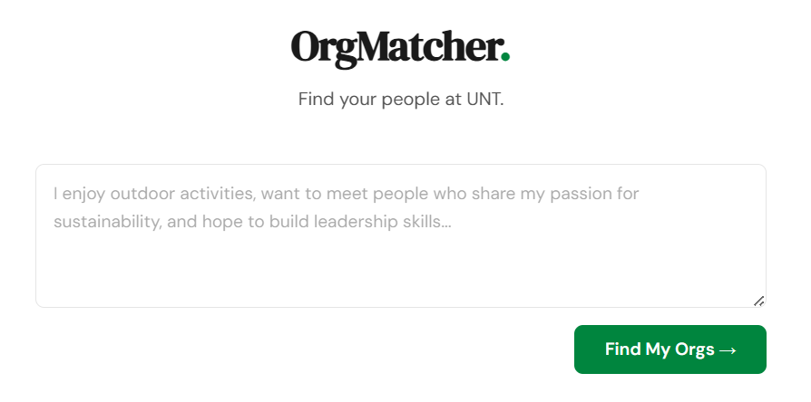
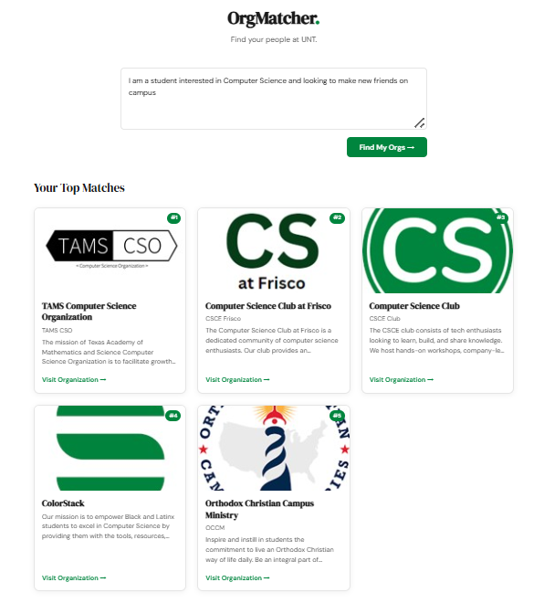

# OrgMatcher

A recommendation engine designed to help students find organizations and clubs at the University of North Texas (UNT) using TF-IDF and other natural language processing techniques.  
Try it out here at **[orgmatcher.vercel.app](https://orgmatcher.vercel.app)**!  

## Documentation 
For a detailed explanation of the goal, implementation, methodology, and process of the project, refer to the project paper at:
**[OrgMatcher Paper](docs/OrgMatcher_Paper.pdf)**.

## Usage
The User will be directly guided to the front page of the website, where they will be prompted to enter anything they are looking for in a campus organization, such as interests, hobbies, and career aspirations.   

  

Clicking "Find My Orgs" will return the five most relevant organizations that match the user's interests.  
In this example, the user inputs "I am a student interested in Computer Science and looking to make new friends on campus"

  

The user can also click "Visit Organization" to go to the organization's webpage on UNT's OrgSync to learn more about the organization.  

  

## Tech Stack
- Frontend: React + Vite (Plain JSX)
- Backend: FastAPI + Python
- NLP & Data: Scikit-Learn (TF-IDF, Cosine Similarity), NLTK (Lemmatization), SQLite (database), BeautifulSoup (scraping)
- Deployment: Vercel (frontend), GCP (backend)